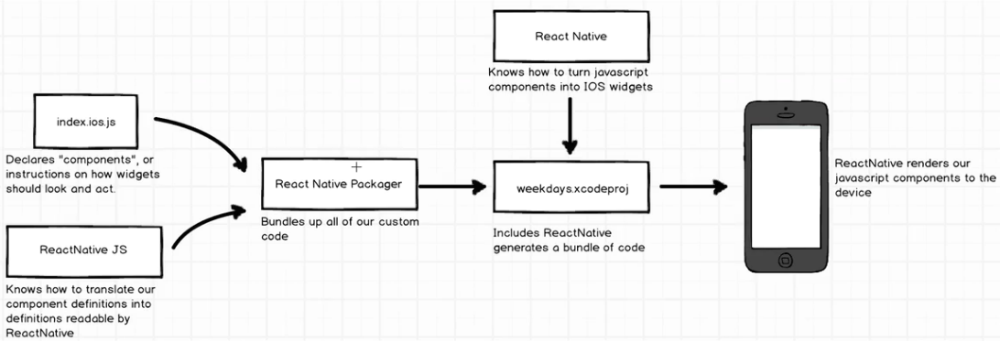

# React Native

## Section 1.1
 TBD
## Section 2.1
In difference to other mobile development frameworks like ionic or framework7 where the application runs in a web browser of the mobile device. This because those frameworks produce html when you compile your application. React Native produces native code, this means that your compiled application is not running in a web browser, **React Native does not** produce html, this means that your are using native views,buttons, text, etc.

### Diagram of how the React Native code gets translated to an actual application:



### Javascript **ES 2015 Syntax** vs **Old-School Syntax**
The ES 2015 Syntax was introduced in 2015, it allows you to better organize your code. Below are some use cases shown in class.

#### Example1: ** Declaring Variables**

```javascript
var React = require('react-native');
// ES 2015 Syntax
var {
  Text,
  View,
  AppRegistry
} = React;

// Old-School Syntax
var Text = React.Text;
var View = React.View;
var AppRegistry = React.AppRegistry;
```

#### Example2: **Fat Arrow**
```javascript
// Create component
var Stopwatch = React.createClass({
  // render method
  render: function(){

  }
});

// ES 2015 Fat Arrow Syntax
AppRegistry.registerComponent('stopwatch', () => Stopwatch);

// Old-School Syntax
AppRegistry.registerComponent('stopwatch', function(){
  return Stopwatch;
});
```

## Appendix

### A. React Native useful commands

#### Create a new project
```bash
react-native init <project-name>
```

#### Starting the React Native project

```bash
cd <path-to-react-native-project>
npm start
```
